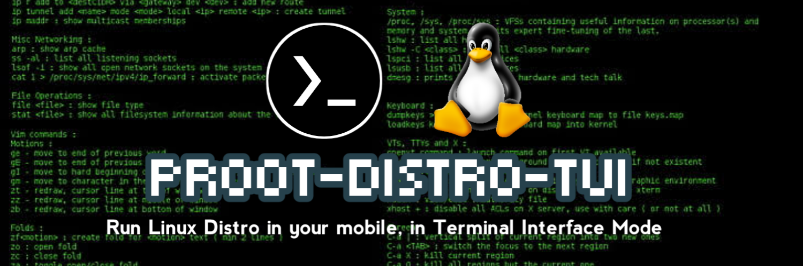
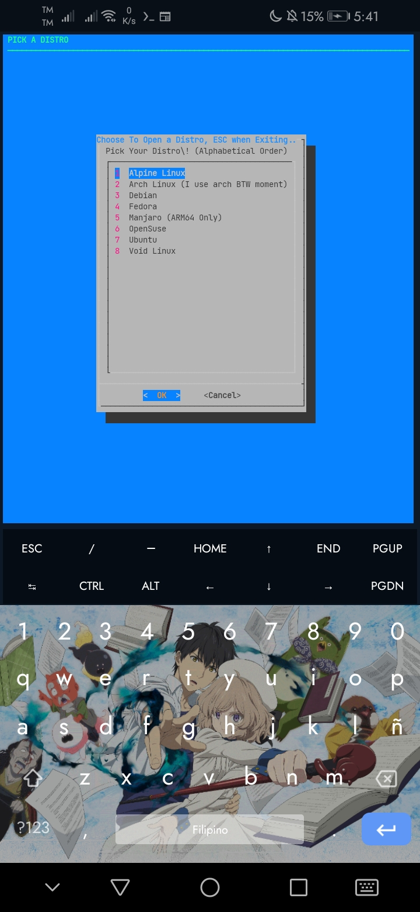
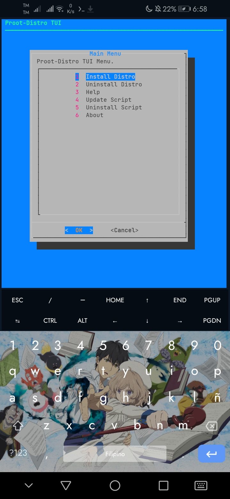
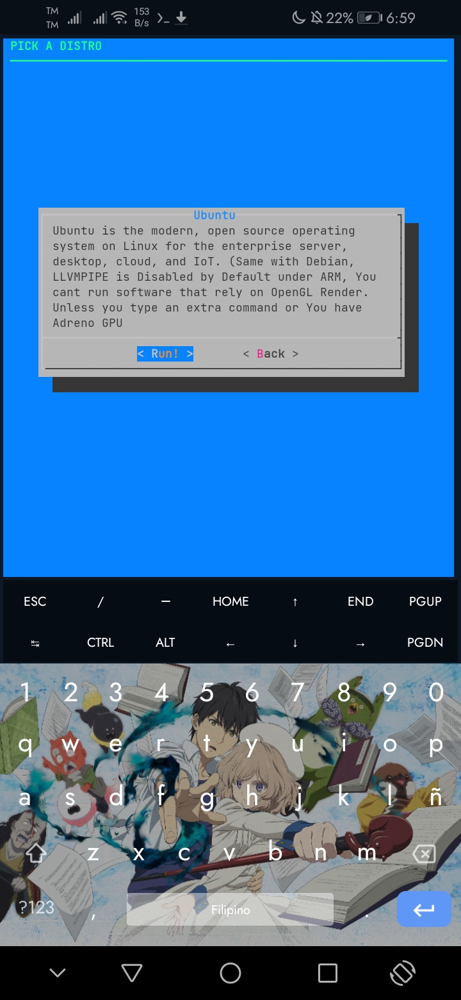

# proot-distro-TUI



"A TUI Manager for proot-distro" 

It Runs on Dialog

## A better tool to Start your Distro on Termux!

A Neat TUI Filled with Necessary Options



## The Script can now be updated Easily here



Updating this script has never been easier. Good Job

## Information about your Distro available!



Each Distro is given information about themselves..

## Run this Code!

``` 

chmod +x onetime.sh && ./onetime.sh 

```

if having issues exiting, spam esc a lot..it helps. is that, the 

``` while true ; do ``` looped too hard. ill soon find the way how to fix that one, or use some forked version of this..  (If someone does...)


## License

This Repo is under GPL 3.0. Anyone Can Have a Copy and customize, but Users have to Stick it to GPL 3.0

## Problems

Check Issues Page. Spam there..

## Updates!🔧

1.8:

Fix `onetime.sh` execution

Version ID on `main.sh` fixed!


## SUGGESTIONS

[**XSDL BY PELYA**](https://play.google.com/store/apps/details?id=x.org.server)

When Attempting to use X11, use XSDL with Pulseaudio support for better Experience

## Notice

Updates may be getting slower soon, Heads up! Because of the Ramadan Season.
